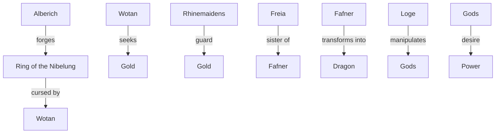
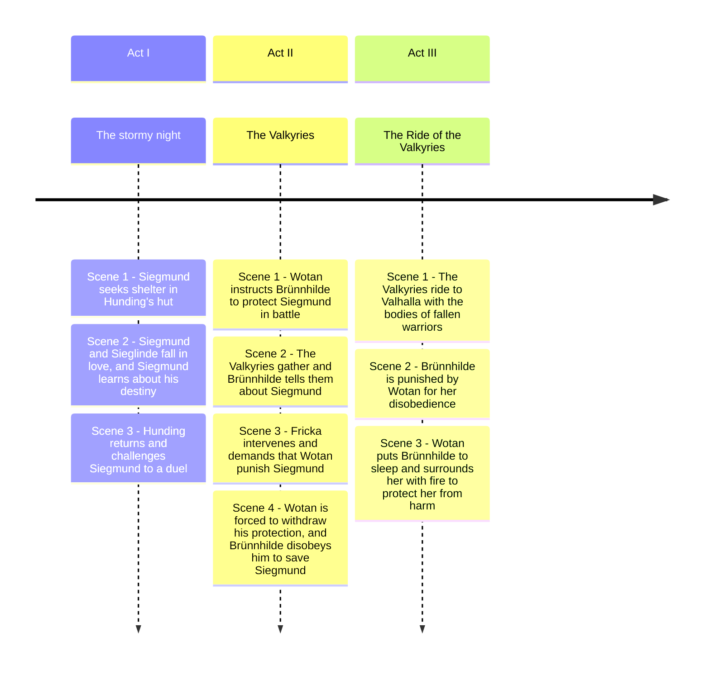

# Das Rheingold (The Rhinegold)

## Synopsis:

The opera opens in the Rhine River, where the Rhine Maidens guard the gold that can grant immense power. Alberich, a Nibelung dwarf, steals the gold after renouncing love. He forges a ring that gives him control over the world. Wotan, the chief god, desires the ring to secure his power and sends his giants, Fasolt and Fafner, to build Valhalla, his new fortress. Wotan ultimately takes the ring from Alberich, leading to a curse that brings doom to all who possess it.

## Relationship

**Alberich**: The Nibelung dwarf who forges the Ring of the Nibelung, which brings power but is cursed. 
**Ring of the Nibelung**: A powerful artifact that drives the plot and characters' actions. 
**Wotan** : The chief god who seeks the gold and is involved in the curse of the Ring. 
**Rhinemaidens** : They guard the gold and lament its loss. 
**Freia** : The goddess associated with beauty and love, connected to the gold. 
**Fafner** : A giant who transforms into a dragon to guard the gold. 
**Loge** : The trickster god who manipulates the other gods for his own ends. 
**Gods** : They desire power, leading to conflict and tragedy. 

## Timeline of the Story

