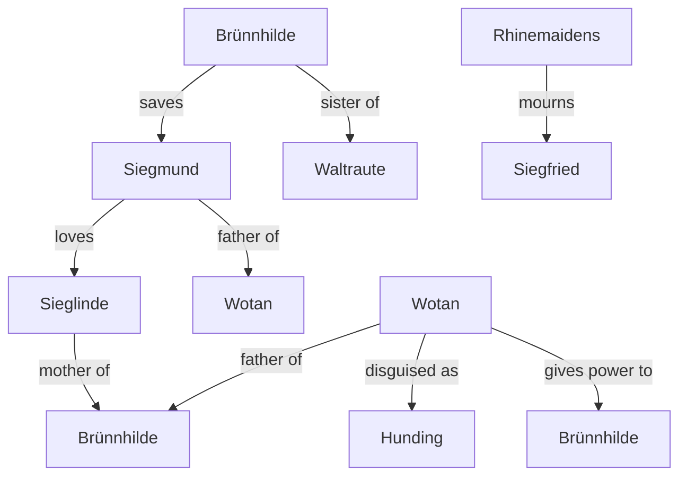
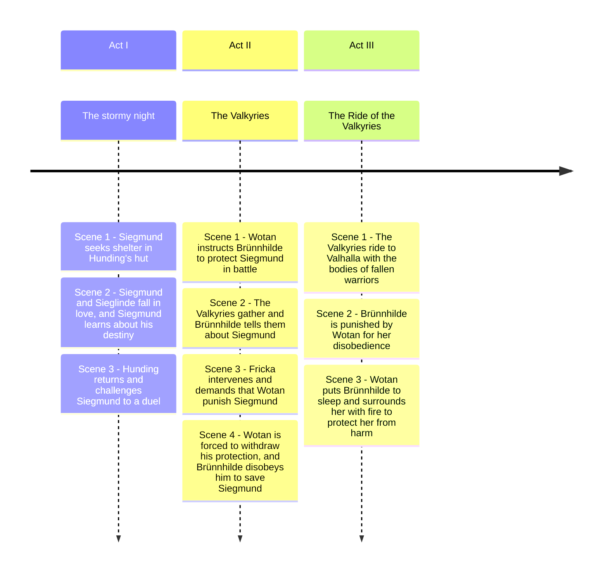

# Die Walküre (The Valkyrie)

## Synopsis:

The story follows Wotan's daughter, Sieglinde, who is married to the wrong man, Hunding. She meets Siegmund, her twin brother, and they fall in love. Wotan, who has been trying to protect them, ultimately allows them to be together. After a fierce battle, Siegmund is killed by Hunding, and Wotan sends his Valkyrie daughter, Brünnhilde, to rescue Siegmund. However, Wotan punishes Brünnhilde for her disobedience, putting her into a deep sleep surrounded by fire, where only a hero can awaken her.

## Relationship

**Siegmund**: A hero who falls in love with his sister, Sieglinde. 
**Sieglinde**: Siegmund's love interest and mother of Brünnhilde. 
**Wotan**: The god who is the father of Brünnhilde and has a complex relationship with the characters. 
**Brünnhilde**: The Valkyrie who saves Siegmund and is a central figure in the story. 
**Hunding**: The antagonist who challenges Siegmund. 
**Waltraute**: Brünnhilde's sister, who has her own role in the narrative. 
**Rhinemaidens**: They mourn Siegfried, connecting the stories of the operas. 

## Timeline of the Story

