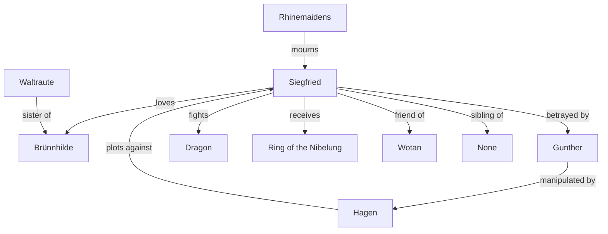
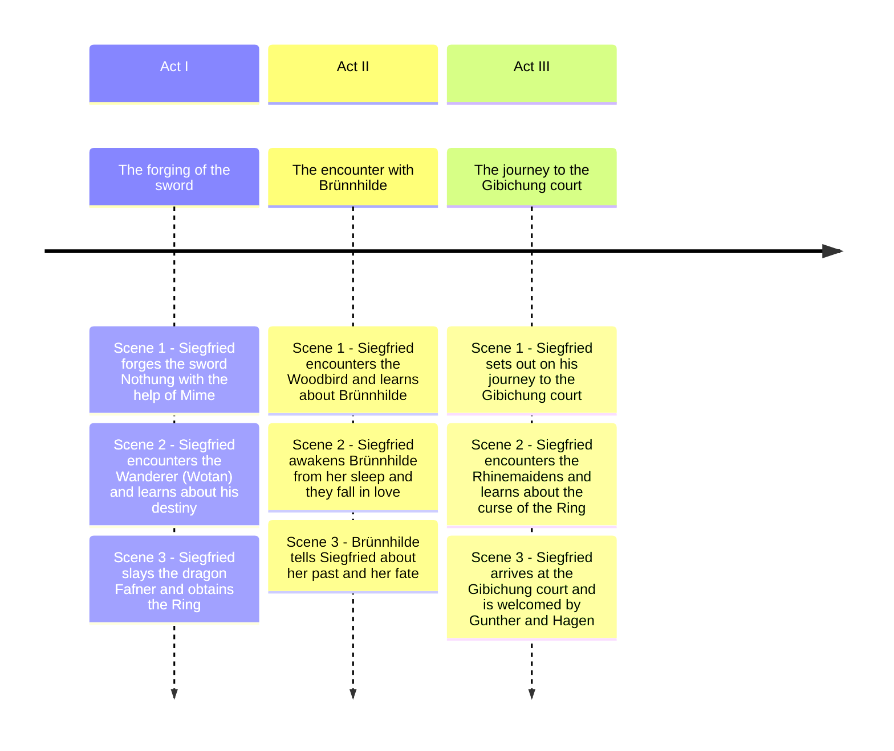

# Siegfried

## Synopsis

The young hero Siegfried, the son of Siegmund and Sieglinde, grows up unaware of his heritage. He forges a sword, Nothung, and defeats the dragon Fafner to claim the ring and the gold. He awakens Brünnhilde from her enchanted sleep and they fall in love. However, Siegfried's quest for glory leads him to betrayals and conflicts, setting the stage for the tragic events to come.

## Relationship

**Siegfried**: The central character, a hero known for his bravery and strength. 
**Brünnhilde**: Siegfried's love interest, representing loyalty and passion. 
**Gunther**: The king who betrays Siegfried, manipulated by Hagen. 
**Hagen**: The antagonist who plots against Siegfried, seeking revenge and power. 
**Dragon**: Represents Siegfried's heroic deeds, including slaying the dragon Fafner. 
**Ring of the Nibelung**: A symbol of power and fate that Siegfried acquires. 
**Wotan**: The god who has a complex relationship with Siegfried, representing fate and destiny. 
**Rhinemaidens**: They mourn Siegfried's death, symbolizing loss and the consequences of greed. 
**Waltraute**: Brünnhilde's sister, who tries to warn Siegfried about the dangers surrounding him. 

## Timeline of the Story

## Highlights :exclamation:

??? example "Notung! Notung! Neidliches Schwert! (Act I)"

    "Notung! Notung! Envy-worthy sword!" 
    This line emphasizes the importance of the sword Notung, which symbolizes Siegfried's destiny and heroism. It represents the power and legacy of his father, Siegmund, and is central to Siegfried's identity as a hero. The sword is a key element in his journey, representing both his strength and the burdens he carries.

??? example "Heil dir, weiser Schmied! (Act I)"

    "Hail to you, wise smith!" 
    This greeting to the smith reflects the respect for craftsmanship and the creation of powerful artifacts. It underscores the theme of creation and the importance of the smiths in the mythology, particularly in forging weapons that shape the fate of the characters.

??? example "Siegfrieds Hornruf - Haha! Da hätte mein Lied (Act II)"

    "Siegfried's horn call - Haha! Then my song would have" 
    This moment captures Siegfried's youthful exuberance and confidence. The horn call signifies his arrival and heroism, marking a pivotal moment in his journey as he embraces his identity and destiny.

??? example "Wer naht dort schimmernd im Schatten? - (Act II)"

    "Who approaches there, shining in the shadows?" 
    This line introduces a sense of mystery and foreshadows the encounters that will shape the narrative. It highlights the themes of fate and the unknown, as characters approach each other with hidden motives and destinies intertwined.

??? example "Mit Mime räng' ich allein um den Ring? (Act II)"

    "With Mime, I alone strive for the ring?"
    This line reflects Alberich's struggle and the central conflict over the Ring of the Nibelung. It emphasizes the themes of greed, power, and betrayal that permeate the opera, as characters vie for control over the Ring and its curse.

??? example "Heil dir, Sonne! Heil dir, Licht! (Act III)"

    "Hail to you, sun! Hail to you, light!" 
    This exclamation celebrates the beauty and life-giving force of the sun and light, symbolizing hope and renewal. It marks a moment of joy and connection between Siegfried and Brünnhilde, highlighting their love and the transformative power of their relationship.

??? example "Siegfried! Siegfried! Seliger Held! (Act III)"

    "Siegfried! Siegfried! Blessed hero!" 
    This line is a declaration of Siegfried's heroism and the recognition of his achievements. It reinforces his status as a legendary figure within the narrative and the admiration he receives from Brünnhilde, who sees him as a savior.

??? example "Dich lieb' ich, o liebtest mich du! (Act III)"

    "I love you, oh, if only you loved me!" 
    This expression of love encapsulates the emotional core of the opera. It reflects the longing and vulnerability of the characters, emphasizing the theme of love as a powerful force that drives their actions and decisions.

??? example "Lachend muss ich dich lieben (Act III)"

    "Laughing, I must love you" 
    This line conveys the complexity of love, suggesting that even in joy, there is an underlying pain or irony. It highlights the bittersweet nature of their relationship, as love is intertwined with sacrifice and fate.

??? example "Ewig war ich, ewig bin ich (Act III)"

    "I was eternal, I am eternal" 
    This declaration of eternal existence speaks to the themes of immortality and the cyclical nature of fate within the opera. It reflects Brünnhilde's understanding of her own identity and the timelessness of the struggles faced by the characters.s

## Songs

### Act I

#### Scene 1

- **Zwangvolle Plage! Müh' ohne Zweck!** (Mime) (03:35)
  "Forced labor! Toil without purpose!"
- **Hoiho! Hoiho! Hau' ein! Hau' ein!** (Siegfried, Mime) (04:01)
  "Hoiho! Hoiho! Strike in! Strike in!"
- **Als zullendes Kind zog ich dich auf** (Mime, Siegfried) (05:23)
  "As a suckling child, I raised you"
- **Es sangen die Vöglein so selig im Lenz** (Siegfried, Mime) (05:12)
  "The little birds sang so sweetly in spring"
- **Einst lag wimmernd ein Weib** (Mime, Siegfried) (08:56)
  "Once a woman lay weeping"

#### Scene 2

- **Heil dir, weiser Schmied!** (The Wanderer, Mime) (04:19)
  "Hail to you, wise smith!"
- **Wie werd' ich den Lauernden los?** (Mime, The Wanderer) (08:05)
  "How will I get rid of the lurking one?"
- **Nun rede, weiser Zwerg** (The Wanderer, Mime) (03:05)
  "Now speak, wise dwarf"
- **Nun, ehrlicher Zwerg** (The Wanderer, Mime) (07:30)
  "Now, honest dwarf"

#### Scene 3

- **Verfluchtes Licht!** (Mime, Siegfried) (01:33)
  "Cursed light!"
- **Bist du es, Kind?** (Mime, Siegfried) (03:03)
  "Is it you, child?"
- **Fühltest du nie im finstren Wald** (Mime, Siegfried) (05:25)
  "Did you never feel in the dark forest"
- **Hättest du fleissig die Kunst gepflegt** (Mime, Siegfried) (03:11)
  "If you had diligently practiced the art"
- **Notung! Notung! Neidliches Schwert!** (Siegfried, Mime) (08:04)
  "Notung! Notung! Envy-worthy sword!"
- **Hoho! Hoho! Hohei! Schmiede, mein Hammer, ein hartes Schwert** (Siegfried, Mime) (03:02)
  "Hoho! Hoho! Hohei! Forge, my hammer, a hard sword"
- **Den der Bruder schuf** (Mime, Siegfried) (02:53)
  "The one created by my brother"

### Act II

#### Scene 1

- **In Wald und Nacht vor Neidhöhl' halt' ich Wacht** (Alberich) (02:12)
  "In forest and night, I keep watch before the cave of envy"
- **Wer naht dort schimmernd im Schatten?** (Alberich, The Wanderer) (08:23)
  "Who approaches there, shining in the shadows?"
- **Mit Mime räng' ich allein um den Ring?** (Alberich, The Wanderer, Fafner) (07:36)
  "With Mime, I alone strive for the ring?"

#### Scene 2

- **Wir sind zur Stelle! Bleib hier stehn!** (Mime, Siegfried) (06:11)
  "We are at the spot! Stay here!"
- **Dass der mein Vater nicht ist** (Siegfried) (10:23)
  "That he is not my father"
- **Siegfrieds Hornruf (Siegfried's Horncall) - Haha! Da hätte mein Lied** (Siegfried, Fafner) (05:23)
  "Siegfried's horn call - Haha! Then my song would have"
- **Wer bist du, kühner Knabe** (Fafner, Siegfried) (04:59)
  "Who are you, bold youth?"
- **Ist mir doch fast, als sprächen die Vög'lein zu mir** (Siegfried, Voice of the Forest Bird) (02:10)
  "It seems to me as if the little birds are speaking to me"

#### Scene 3

- **Wohin schleichst du eilig und schlau** (Alberich, Mime, Siegfried, Voice of the Forest Bird) (05:38)
  "Where are you sneaking off to, quickly and slyly?"
- **Willkommen, Siegfried!** (Mime, Siegfried) (07:22)
  "Welcome, Siegfried!"
- **Neides Zoll zahlt Notung** (Siegfried) (02:48)
  "Notung pays the toll of envy"
- **Heiss ward mir von der harten Last!** (Siegfried) (03:47)
  "I was hot from the hard burden!"
- **Nun sing'! Ich lausche dem Gesang** (Siegfried, Voice of the Forest Bird) (04:40)
  "Now sing! I listen to the song"

### Act III

#### Scene 1

- **Wache, Wala! Wala! Erwach'!** (The Wanderer) (02:20)
  "Awake, Wala! Wala! Awaken!"
- **Stark ruft das Lied** (Erda, The Wanderer) (03:01)
  "The song calls strongly"
- **Mein Schlaf ist Träumen** (Erda, The Wanderer) (04:20)
  "My sleep is dreaming"
- **Wirr wird mir, seit ich erwacht** (Erda, The Wanderer) (03:22)
  "I am confused, since I awoke"
- **Weisst du, was Wotan will?** (The Wanderer) (04:06)
  "Do you know what Wotan wants?"

#### Scene 2

- **Dort seh ich Siegfried nahen** (The Wanderer, Siegfried) (03:56)
  "There I see Siegfried approaching"
- **Was lachst du mich aus?** (Siegfried, The Wanderer) (04:20)
  "Why are you laughing at me?"
- **Bleibst du mir stumm, störrischer Wicht?** (Siegfried, The Wanderer) (04:20)
  "Will you remain silent, stubborn wretch?"

#### Scene 3

- **Orchesterzwischenspiel** (Entr'acte) (05:38)
  "Orchestral interlude"
- **Selige Öde auf sonniger Höh'!** (Siegfried) (04:47)
  "Blissful solitude on sunny heights!"
- **Das ist kein Mann!** (Siegfried) (07:29)
  "That is no man!"
- **Brünnhildes Erwachen** (Brünnhilde's Awakening) (01:23)
  "Brünnhilde's awakening"
- **Heil dir, Sonne! Heil dir, Licht!** (Brünnhilde, Siegfried) (04:19)
  "Hail to you, sun! Hail to you, light!"
- **Siegfried! Siegfried! Seliger Held!** (Brünnhilde, Siegfried) (06:47)
  "Siegfried! Siegfried! Blessed hero!"
- **Dort seh' ich Grane** (Brünnhilde, Siegfried) (06:33)
  "There I see Grane"
- **Sangst du mir nicht** (Siegfried, Brünnhilde) (02:33)
  "Did you not sing to me"
- **Ewig war ich, ewig bin ich** (Brünnhilde, Siegfried) (04:36)
  "I was eternal, I am eternal"
- **Dich lieb' ich, o liebtest mich du!** (Siegfried, Brünnhilde) (05:37)
  "I love you, oh, if only you loved me!"
- **Lachend muss ich dich lieben** (Brünnhilde, Siegfried) (02:14)
  "Laughing, I must love you"
