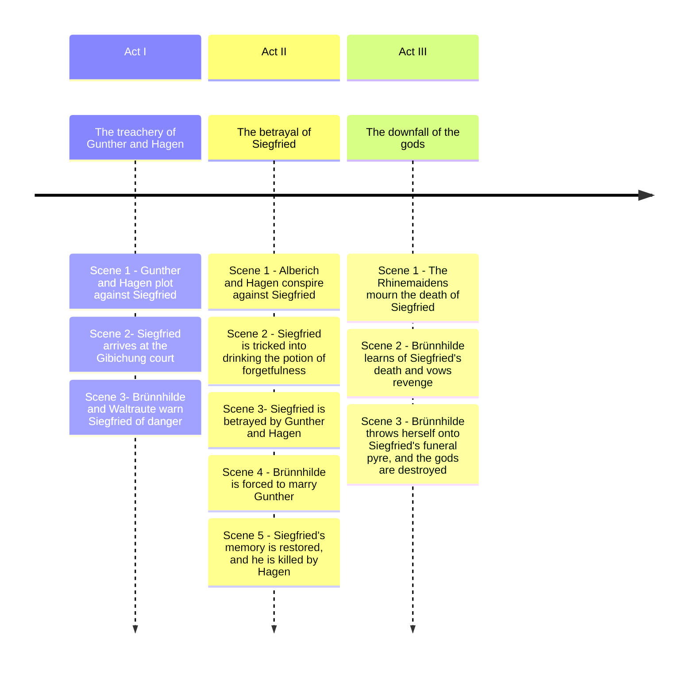
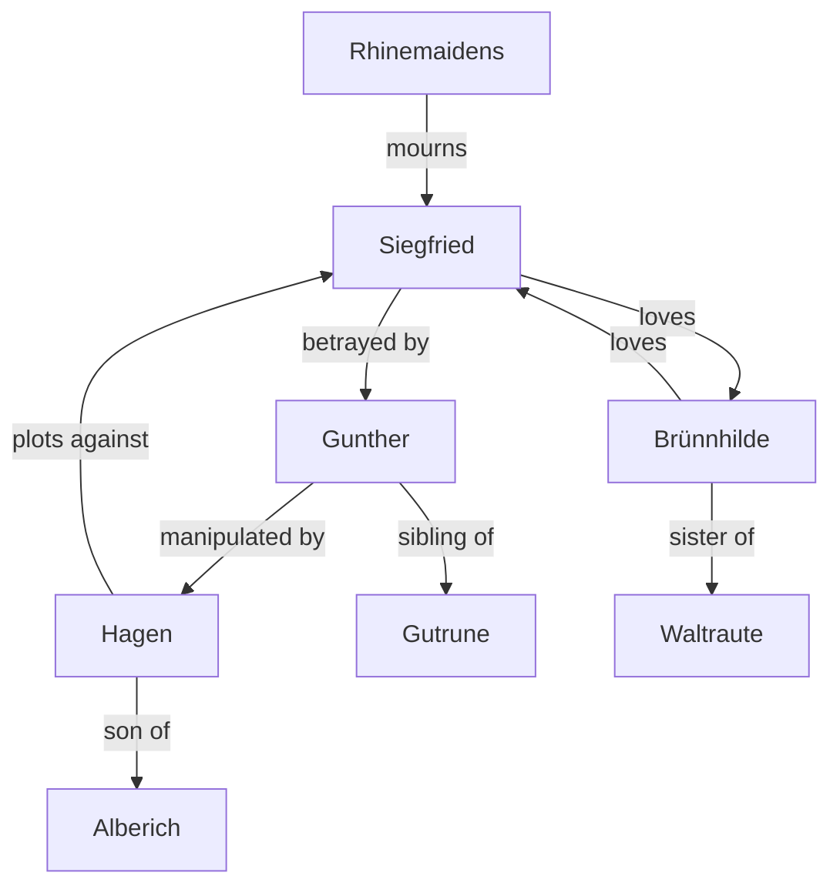

# Götterdämmerung (Twilight of the Gods)

## Synopsis

The final opera depicts the downfall of the gods and the consequences of the curse of the ring. Siegfried is manipulated by Hagen, the son of Alberich, who seeks revenge for his father's loss. Hagen tricks Siegfried into revealing his vulnerabilities, leading to Siegfried's death. Brünnhilde, devastated by Siegfried's betrayal and death, returns the ring to the Rhine, breaking the curse. The cycle concludes with the destruction of Valhalla and the gods, symbolizing the end of an era and the possibility of renewal.

## Timeline of the Story



# Relationship Diagrams

## Characters in Götterdämmerung

**Siegfried** - The hero of the story, a dragon-slayer who possesses the Ring of the Nibelung.<br>
**Brünnhilde** - A Valkyrie and Siegfried's lover, who is betrayed and ultimately seeks revenge.<br>
**Gunther** - The king of the Gibichungs, who is manipulated by Hagen.<br>
**Hagen** - The villain of the story, son of Alberich, who seeks to regain the Ring and destroy Siegfried.<br>
**Gutrune** - Gunther's sister, who is also involved in the plot against Siegfried.<br>
**Alberich** - The Nibelung dwarf, father of Hagen, who originally forged the Ring.<br>
**Waltraute** - Brünnhilde's sister, who tries to warn her about the impending doom.<br>
**Rhinemaidens** - Three maidens who guard the Rhine gold and lament the loss of the Ring.<br>



## Highlights

??? example "1. **Siegfrieds Rheinfahrt (Siegfried's Rhine Journey)**"

    This piece marks Siegfried's journey to the Rhine, symbolizing his connection to the natural world and the fate that awaits him. It serves as a transition in the narrative, highlighting his heroic status and foreshadowing the events that will unfold.

??? example "2. **Blut-Brüderschaft schwöre ein Eid!** (Siegfried, Gunther, Hagen, Gutrune)"

    This oath of blood brotherhood signifies loyalty and the bonds of friendship among the characters. However, it also foreshadows betrayal, as the characters' fates are intertwined with deception and manipulation, particularly by Hagen.

??? example "3. **Helle Wehr! Heilige Waffe!** (Siegfried, Brünnhilde, Chorus)"

    This declaration emphasizes the sacredness of weapons and the warrior's duty. It reflects the themes of honor and valor, as well as the impending conflict that will arise from the struggle for power and the Ring.

??? example "4. **Siegfrieds Trauermarsch (Siegfried's Funeral March)**"

    This mournful piece underscores the tragedy of Siegfried's death and the profound loss felt by the characters. It serves as a poignant reminder of the consequences of ambition and the cyclical nature of violence and revenge in the narrative.

??? example "5. **Brünnhilde! Heilige Braut!** (Siegfried)"

    This line reflects Alberich's struggle and the central conflict over the Ring of the Nibelung. It emphasizes the themes of greed, power, and betrayal that permeate the opera, as characters vie for control over the Ring and its curse.

??? example "6. **Frau Sonne sendet lichte Strahlen** (Rhinemaidens)"

    This exclamation celebrates the beauty and life-giving force of the sun and light, symbolizing hope and renewal. It marks a moment of joy and connection between Siegfried and Brünnhilde, highlighting their love and the transformative power of their relationship.

??? example "7. **Ich höre sein Horn** (Rhinemaidens, Siegfried)"

    This line is a declaration of Siegfried's heroism and the recognition of his achievements. It reinforces his status as a legendary figure within the narrative and the admiration he receives from Brünnhilde, who sees him as a savior.

??? example "8. **Was leid' ich doch das karge Lob?** (Siegfried, Rhinemaidens)"

    This expression of love encapsulates the emotional core of the opera. It reflects the longing and vulnerability of the characters, emphasizing the theme of love as a powerful force that drives their actions and decisions.

??? example "9. **Mime hiess ein mürrischer Zwerg** (Siegfried, Hagen, Vassals)"

    This line conveys the complexity of love, suggesting that even in joy, there is an underlying pain or irony. It highlights the bittersweet nature of their relationship, as love is intertwined with sacrifice and fate.

??? example "10. **Fliegt heim, ihr Raben!** (Brünnhilde)"

    This declaration of eternal existence speaks to the themes of immortality and the cyclical nature of fate within the opera. It reflects Brünnhilde's understanding of her own identity and the timelessness of the struggles faced by the characters.

## Act, Scene, and arias

### Prologue

#### Vorspiel (Prelude)

- **Prelude**

- Welch' Licht leuchtet dort? (3 Norns) - **What light shines there?**

- Orchesterzwischenspiel, "Tagesgrauen" (Dawn) - **Orchestral Interlude, "Dawn"**

- Zu neuen Taten, teurer Helde (Brünnhilde) - **To new deeds, noble hero**

- Mehr gabst du, Wunderfrau (Siegfried, Brünnhilde) - **You gave more, wonderful woman**

- Siegfrieds Rheinfahrt (Siegfried's Rhine Journey) - **Siegfried's Rhine Journey**

### Act I

#### Scene 1

- **Nun hör', Hagen, sage mir, Held** (Gunther, Hagen, Gutrune) - **Now hear, Hagen, tell me, hero**
- **Was weckst du Zweifel und Zwist?** (Gunther, Hagen, Gutrune) - **Why do you awaken doubt and strife?**
- **Vom Rhein her tönt das Horn** (Gunther, Hagen, Siegfried) - **From the Rhine, the horn sounds**

#### Scene 2

- **Wer ist Gibichs Sohn?** (Siegfried, Gunther, Hagen) - **Who is Gibich's son?**
- **Begrüsse froh, o Held** (Gunther, Siegfried, Hagen) - **Greet joyfully, oh hero**
- **Willkommen, Gast, in Gibichs Haus!** (Gutrune, Siegfried, Gunther) - **Welcome, guest, to Gibich's house!**
- **Hast du, Gunther, ein Weib?** (Siegfried, Gunther) - **Do you, Gunther, have a wife?**
- **Blut-Brüderschaft schwöre ein Eid!** (Siegfried, Gunther, Hagen, Gutrune) - **Blood-brotherhood, swear an oath!**
- **Hier sitz' ich zur Wacht, wahre den Hof** (Hagen) - **Here I sit on watch, guarding the court**
- **Orchesterzwischenspiel (Entr'acte)** - **Orchestral Interlude**

#### Scene 3

- **Altgewohntes Geräusch** (Brünnhilde, Waltraute) - **Familiar sound**
- **Seit er von dir geschieden** (Waltraute) - **Since he parted from you**
- **Da sann ich nach: von seiner Seite** (Waltraute, Brünnhilde) - **Then I thought: from his side**
- **Blitzend Gewölk** (Brünnhilde, Siegfried) - **Lightning cloud**
- **Jetzt bist du mein** (Siegfried, Brünnhilde) - **Now you are mine**

### Act II

#### Vorspiel (Prelude)

- **Prelude**

#### Scene 1

- **Schläfst du, Hagen, mein Sohn?** (Alberich, Hagen) - **Are you sleeping, Hagen, my son?**
- **Orchesterzwischenspiel (Entr'acte)** - **Orchestral Interlude**

#### Scene 2

- **Hoiho, Hagen! Müder Mann!** (Siegfried, Hagen, Gutrune) - **Hoiho, Hagen! Weary man!**

#### Scene 3

- **Hoiho! Hoihohoho!** (Hagen, Vassals) - **Hoiho! Hoihohoho!**

#### Scene 4

- **Heil dir, Gunther!** (Vassals) - **Hail to you, Gunther!**
- **Brünnhild', die hehrste Frau** (Gunther, Vassals) - **Brünnhilde, the noblest woman**
- **Was ist ihr? Ist sie entrückt?** (Chorus, Siegfried, Brünnhilde, Hagen, Gunther, Gutrune) - **What is she? Is she enchanted?**
- **Achtest du so der eignen Ehre?** (Siegfried, Brünnhilde, Chorus, Gunther, Gutrune, Hagen) - **Do you thus respect your own honor?**
- **Helle Wehr! Heilige Waffe!** (Siegfried, Brünnhilde, Chorus) - **Bright armor! Holy weapon!**

#### Scene 5

- **Welches Unholds List liegt hier verhohlen?** (Brünnhilde, Hagen, Gunther) - **What villain's cunning is hidden here?**
- **Dir hilft kein Hirn** (Hagen, Gunther, Brünnhilde) - **No brain will help you**

### Act III

#### Vorspiel (Prelude)

- **Prelude**

#### Scene 1

- **Frau Sonne sendet lichte Strahlen** (Rhinemaidens) - **Lady Sun sends bright rays**
- **Ich höre sein Horn** (Rhinemaidens, Siegfried) - **I hear his horn**
- **Was leid' ich doch das karge Lob?** (Siegfried, Rhinemaidens) - **Why do I suffer such meager praise?**

#### Scene 2

- **Hoiho? - Hoihe!** (Hagen, Male Chorus, Siegfried, Gunther) - **Hoiho? - Hoihe!**
- **Mime hiess ein mürrischer Zwerg** (Siegfried, Hagen, Vassals) - **Mime was a grumpy dwarf**
- **Was hör' ich!** (Gunther, Hagen, Vassals) - **What do I hear!**
- **Brünnhilde! Heilige Braut!** (Siegfried) - **Brünnhilde! Holy bride!**
- **Siegfrieds Trauermarsch (Siegfried's Funeral March)** - **Siegfried's Funeral March**

#### Scene 3

- **War das sein Horn?** (Gutrune, Hagen, Gunther) - **Was that his horn?**
- **Schweigt eures Jammers** (Brünnhilde, Gutrune) - **Silence your lament**
- **Starke Scheite schichtet mir dort** (Brünnhilde) - **Strong logs are piled up for me there**
- **Mein Erbe nun nehm' ich zu eigen** (Brünnhilde) - **My inheritance I now take as my own**
- **Fliegt heim, ihr Raben!** (Brünnhilde) - **Fly home, you ravens!**
- **Schluss (Conclusion)** (Hagen) - **Conclusion**

```

```
