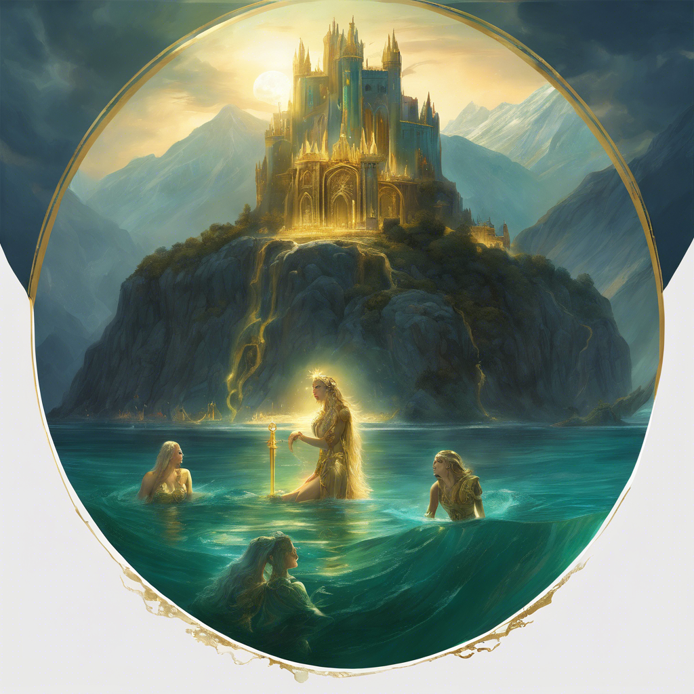
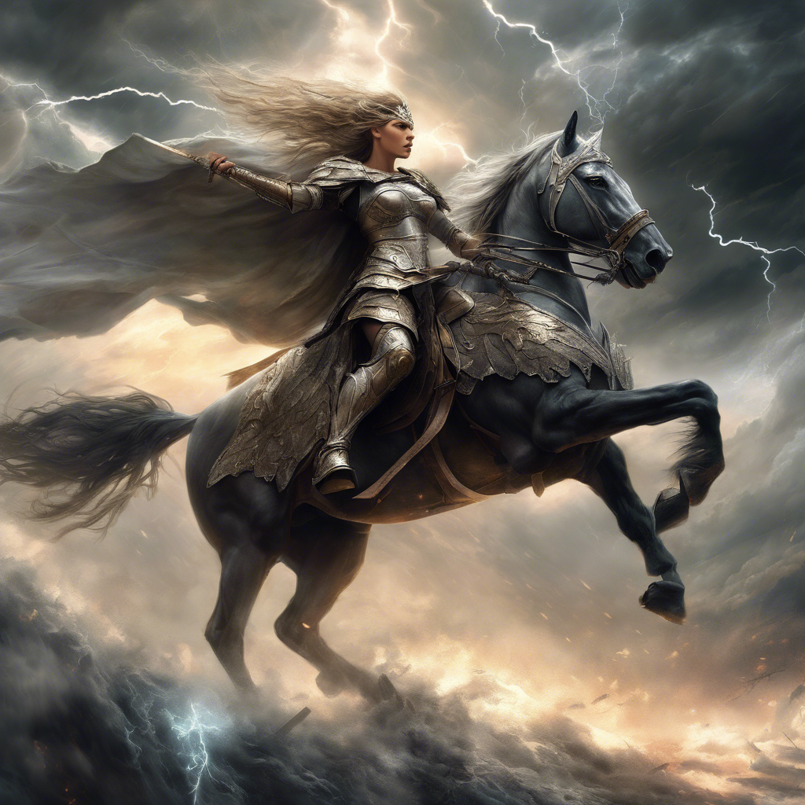
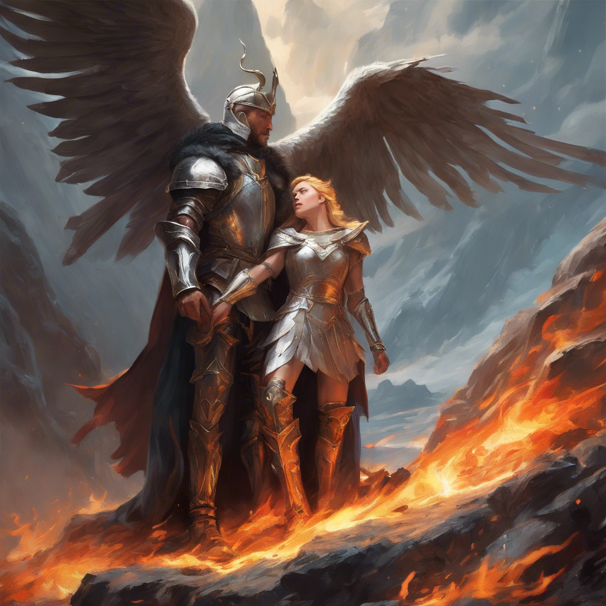
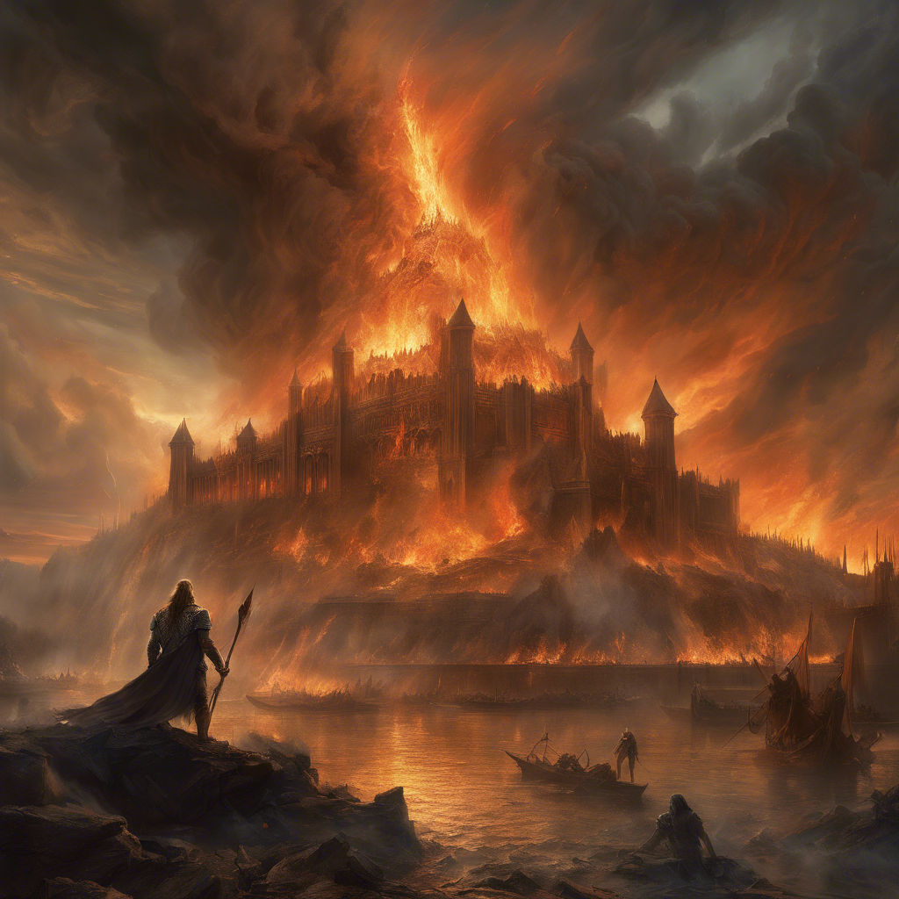
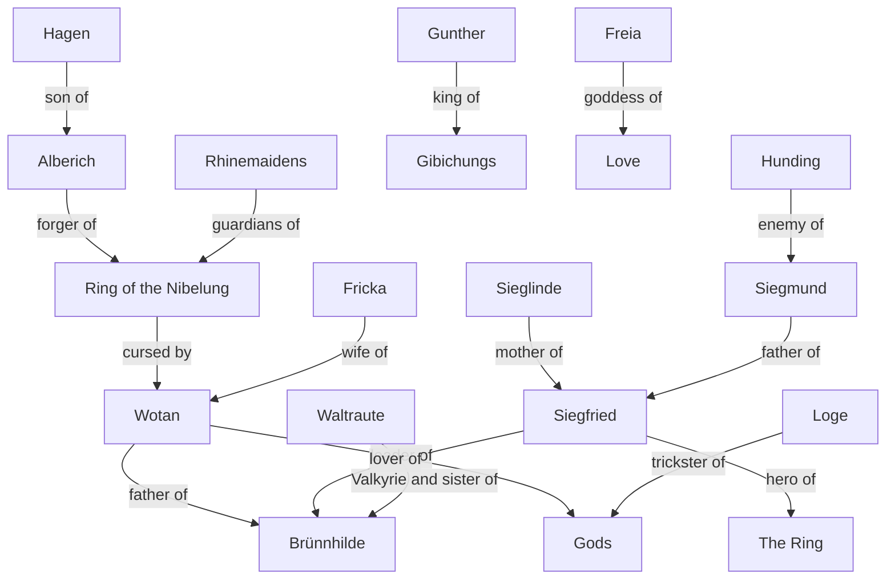

# Der Ring des Nibelungen

## The four nights

!!! Abstract "Das Rheingold (The Rhinegold)"

    === "Scene 1"

        ```markdown
        * The Rhine Maidens guard the Rhine gold
        * Alberich steals the gold after rejecting love
        ```
    === "Scene 2"

        ```markdown
        * Wotan and Fricka discuss the need for a new home
        * Wotan and Loge visit the Nibelheim
        * Wotan confronts Alberich and claims the Ring
        ```

    === "Scene 3"
        ```markdown
        * The gods build Valhalla with the help of the giants
        * Freia is taken as payment for the giants
        * Wotan gives the Ring to the giants to pay for Freia
        ```

    === "Scene 4"

        ```markdown
        * The curse of the Ring begins to take effect
        * The giants quarrel over the Ring
        * Fafner kills Fasolt for the Ring
        * Wotan realizes the consequences of his actions
        ```



!!! Abstract "Die Walküre (The Valkyrie)"

    === "Act I"
        ```markdown
        * Wotan visits the sleeping Brünnhilde, his daughter, who is under a spell.
        * Wotan reveals his plan to protect Siegmund and Sieglinde.
        * Siegmund and Sieglinde meet and fall in love, unaware of their sibling relationship.
        * Wotan gives Siegmund the sword Nothung to help him in battle.
        ```

    === "Act II"
        ```markdown
        * Siegmund and Sieglinde are pursued by Hunding, Siegmund's enemy.
        * A fierce battle ensues between Siegmund and Hunding.
        * Wotan intervenes, allowing Siegmund to win the fight.
        * Wotan's wife, Fricka, confronts him about Siegmund's actions and demands justice.
        * Wotan reluctantly decides to let Hunding kill Siegmund.
        ```

    === "Act III"
        ```markdown
        * Wotan sends Brünnhilde to protect Siegmund, but he ultimately orders her to let him die.
        * Brünnhilde defies Wotan and helps Siegmund in battle.
        * Siegmund is ultimately killed by Hunding.
        * Brünnhilde takes Sieglinde away to protect her and the unborn child.
        * Wotan punishes Brünnhilde for her disobedience by putting her into a deep sleep surrounded by fire.
        * Brünnhilde vows to find a hero who can rescue her from the flames.
        ```



!!! Abstract "Siegfried"

    === "Act I"
        ```markdown
        * Siegfried, raised by Mime, seeks to forge a sword to defeat the dragon Fafner.
        * Mime fails to recreate Nothung, the sword of Siegfried's father.
        * Siegfried finds the broken pieces of Nothung and reforges it with the help of the forest bird.
        * Siegfried defeats Fafner and claims the Ring of power.
        ```


    === "Act II"
        ```markdown
        * Siegfried encounters Brünnhilde, awakening her from her enchanted sleep.
        * They fall in love, and Siegfried gives Brünnhilde the Ring.
        * Wotan, disguised as a wanderer, warns Siegfried about the curse of the Ring.
        * Siegfried leaves Brünnhilde to seek adventure and encounters the Gibichung family.
        ```

    === "Act III"
        ```markdown
        * Siegfried is manipulated by Hagen into betraying Brünnhilde.
        * He marries Gutrune, Hagen's sister, and forgets his love for Brünnhilde.
        * Hagen plots to kill Siegfried and take the Ring.
        * Siegfried is mortally wounded, and Brünnhilde learns of his death.
        * Brünnhilde sacrifices herself on Siegfried's funeral pyre, ending the curse of the Ring.
        ```



!!! Abstract "Götterdämmerung (Twilight of the Gods)"

    === "Act I"
        ```markdown
        * The Gibichung family prepares for Siegfried and Gutrune's wedding.
        * Hagen plots to gain control of the Ring and manipulate Siegfried.
        * Siegfried, under Hagen's influence, forgets Brünnhilde and marries Gutrune.
        * Hagen reveals the truth about the Ring and incites Siegfried to seek revenge on the gods.
        ```

    === "Act II"
        ```markdown
        * Brünnhilde learns of Siegfried's betrayal and feels heartbroken.
        * Hagen and Gunther conspire to capture Brünnhilde and take the Ring from her.
        * Siegfried is tricked into fighting Gunther for Brünnhilde.
        * Brünnhilde is taken back to Gunther's castle, and Siegfried is manipulated into giving up the Ring.
        ```

    === "Act III"
        ```markdown
        * Hagen murders Siegfried to claim the Ring.
        * Brünnhilde confronts Hagen and reveals the truth about Siegfried's death.
        * In her grief, she returns the Ring to the Rhine, ending the curse.
        * The gods and the world are consumed by flames, marking the end of the old order.
        * The Rhine Maidens reclaim the Ring from the depths, restoring balance.
        ```



## Characters

**Wotan**: The chief god and leader of the gods.<br>
**Brünnhilde**: A Valkyrie and Wotan's daughter.<br>
**Alberich**: A Nibelung dwarf who forges the Ring of the Nibelung.<br>
**Siegfried**: The hero of The Ring and Brünnhilde's lover.<br>
**Sieglinde**: Siegfried's mother and Siegmund's lover.<br>
**Siegmund**: Siegfried's father and Sieglinde's lover.<br>
**Hunding**: Siegmund's enemy and Sieglinde's husband.<br>
**Gunther**: The king of the Gibichungs.<br>
**Hagen**: Gunther's half-brother and Alberich's son.<br>
**Loge**: A trickster god and Wotan's advisor.<br>
**Fricka**: Wotan's wife and the goddess of marriage.<br>
**Freia**: The goddess of love and beauty.<br>
**Fafner**: A giant who transforms into a dragon.<br>
**Fasolt**: A giant and Fafner's brother.<br>
**Rhinemaidens**: The guardians of the Rhine River and the gold.<br>
**Erda**: The earth goddess and Wotan's lover.<br>
**Norns**: The fates who weave the destiny of the gods.<br>
**Waltraute**: A Valkyrie and Brünnhilde's sister.<br>
**Mime**: A Nibelung dwarf and Siegfried's foster father.<br>
**The Gods**: The gods and goddesses of the Norse pantheon<br>


