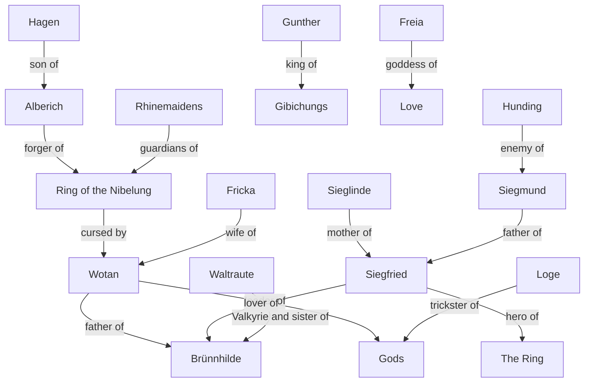

# Ring Cycle

## The four nights

- Das Rheingold (The Rhinegold)
- Die Walküre (The Valkyrie)
- Siegfried
- Götterdämmerung (Twilight of the Gods)

## Characters

**Wotan**: The chief god and leader of the gods. 
**Brünnhilde**: A Valkyrie and Wotan's daughter. 
**Alberich**: A Nibelung dwarf who forges the Ring of the Nibelung. 
**Siegfried**: The hero of The Ring and Brünnhilde's lover. 
**Sieglinde**: Siegfried's mother and Siegmund's lover. 
**Siegmund**: Siegfried's father and Sieglinde's lover. 
**Hunding**: Siegmund's enemy and Sieglinde's husband. 
**Gunther**: The king of the Gibichungs. 
**Hagen**: Gunther's half-brother and Alberich's son. 
**Loge**: A trickster god and Wotan's advisor. 
**Fricka**: Wotan's wife and the goddess of marriage. 
**Freia**: The goddess of love and beauty. 
**Fafner**: A giant who transforms into a dragon. 
**Fasolt**: A giant and Fafner's brother. 
**Rhinemaidens**: The guardians of the Rhine River and the gold. 
**Erda**: The earth goddess and Wotan's lover. 
**Norns**: The fates who weave the destiny of the gods. 
**Waltraute**: A Valkyrie and Brünnhilde's sister. 
**Mime**: A Nibelung dwarf and Siegfried's foster father. 
**The Gods**: The gods and goddesses of the Norse pantheon 

