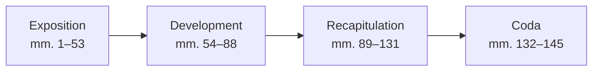

# Prokofiev Piano Sonata No. 1 in F minor, Op. 1

## Overview

| | |
|---|---|
| **Composer** | Sergei Prokofiev |
| **Key** | F minor |
| **Opus** | 1 |
| **Composed** | 1907, revised 1909 |
| **Premiered** | 6 March 1910, Moscow |
| **Duration** | ~5 minutes |
| **Movements** | 1 (single movement) |

## Structure and Form

Prokofiev's first numbered sonata is a compact single-movement work in
**sonata form**. Written while he was still a student at the St. Petersburg
Conservatory, it already shows his characteristic drive and angularity.

### Formal Outline

| Section | Bars | Key | Character |
|---------|------|-----|-----------|
| **Exposition** | | | |
| — Theme 1 | 1–18 | F minor | Driving, angular, marcato |
| — Transition | 19–30 | → A♭ major | Modulatory, rising sequences |
| — Theme 2 | 31–45 | A♭ major | More lyrical, flowing |
| — Closing | 46–53 | A♭ major | Cadential |
| **Development** | 54–88 | Various | Fragmentation of Theme 1 |
| **Recapitulation** | | | |
| — Theme 1 | 89–106 | F minor | Return, intensified |
| — Theme 2 | 107–123 | F major → F minor | Tonal adjustment |
| — Closing | 124–131 | F minor | |
| **Coda** | 132–145 | F minor | Decisive, fff ending |

## Character and Difficulty

- Requires strong rhythmic drive and stamina
- Angular melodic writing foreshadows later Prokofiev
- Technically moderate compared to later sonatas
- Key challenge: sustaining intensity through a single-movement arc

## Listening Notes

A student work, but unmistakably Prokofiev. The harmonic language already
pushes beyond late Romanticism — unexpected bass notes, abrupt dynamic
shifts, and that particular percussive energy at the keyboard.

## References

- [IMSLP Score](https://imslp.org/wiki/Piano_Sonata_No.1,_Op.1_(Prokofiev,_Sergey))
- [Wikipedia](https://en.wikipedia.org/wiki/Piano_Sonata_No._1_(Prokofiev))
