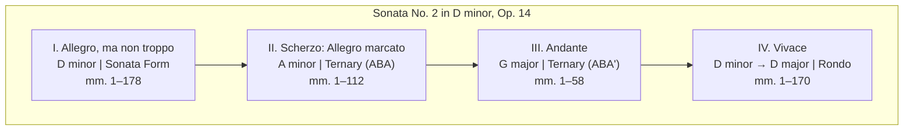
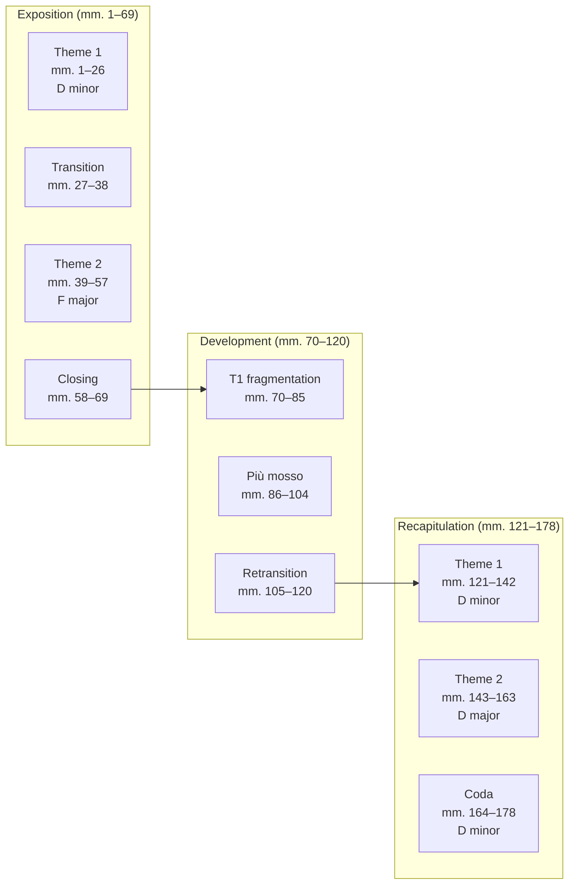
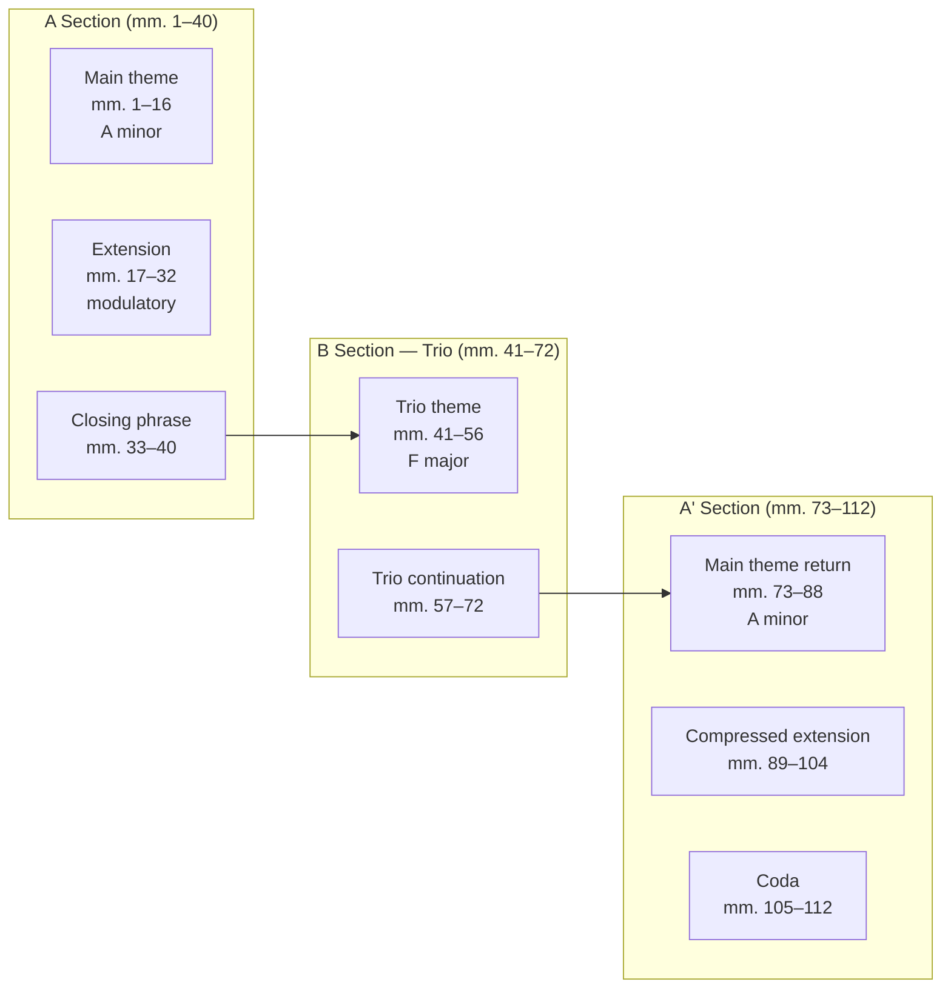
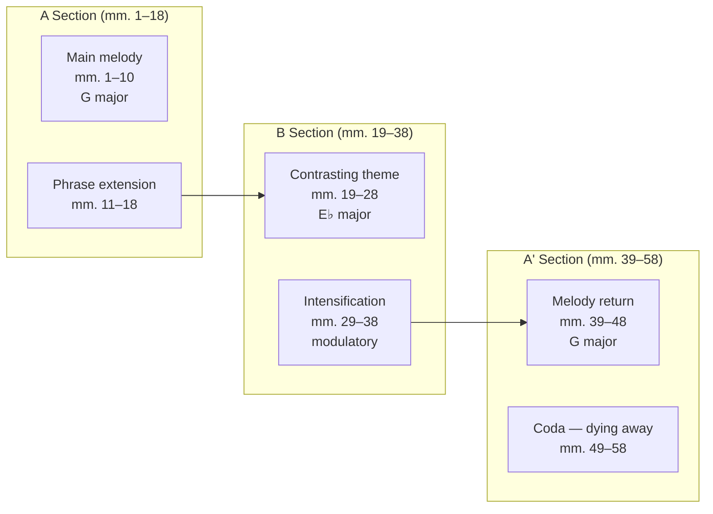
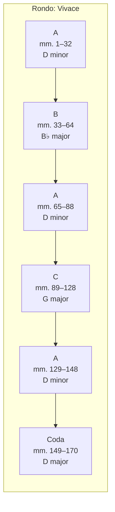

# Prokofiev Piano Sonata No. 2 in D minor, Op. 14

## Overview

| | |
|---|---|
| **Composer** | Sergei Prokofiev |
| **Key** | D minor |
| **Opus** | 14 |
| **Composed** | 1912 |
| **Premiered** | 5 February 1914, Moscow |
| **Duration** | ~18–20 minutes |
| **Movements** | 4 |

## Structure and Form (with Bar Numbers)

A four-movement sonata that is lean, transparent, and pungent. Prokofiev's
second sonata already shows full command of large-scale form while remaining
economical — no bar is wasted.

### Complete Architecture

---

### I. Allegro, ma non troppo (D minor)

Sonata form with a characteristically compressed recapitulation.

| Section | Bars | Key | Character |
|---------|------|-----|-----------|
| Theme 1 | 1–26 | D minor | Brooding, rhythmically driven |
| Transition | 27–38 | → F major | Ascending sequences |
| Theme 2 | 39–57 | F major | Lyrical, singing quality |
| Closing | 58–69 | F major | Cadential figures |
| Development | 70–120 | Various | Fragmentation, Più mosso climax |
| Recap — Theme 1 | 121–142 | D minor | Compressed return |
| Recap — Theme 2 | 143–163 | D major | Tonal resolution |
| Coda | 164–178 | D minor | Quiet, unresolved ending |

---

### II. Scherzo: Allegro marcato (A minor)

A sharp, biting scherzo in ternary form with a contrasting lyrical trio.

| Section | Bars | Key | Character |
|---------|------|-----|-----------|
| A — Main theme | 1–16 | A minor | Staccato, angular, percussive |
| A — Extension | 17–40 | Modulatory | Driving eighth-note motion |
| B — Trio | 41–72 | F major | Legato, gentler contrast |
| A' — Return | 73–104 | A minor | Intensified reprise |
| Coda | 105–112 | A minor | Abrupt, dry ending |

---

### III. Andante (G major)

A brief, lyrical slow movement — simple ternary form with expressive warmth.

| Section | Bars | Key | Character |
|---------|------|-----|-----------|
| A — Melody | 1–18 | G major | Tender, singing, simple texture |
| B — Contrasting | 19–38 | E♭ major → mod. | More chromatic, restless |
| A' — Return | 39–50 | G major | Decorated reprise |
| Coda | 51–58 | G major | ppp, dissolving |

---

### IV. Vivace (D minor → D major)

A tarantella-like finale in rondo form — relentless energy driving toward
a triumphant D major conclusion.

| Section | Bars | Key | Character |
|---------|------|-----|-----------|
| A — Refrain | 1–32 | D minor | Tarantella, perpetual motion |
| B — Episode 1 | 33–64 | B♭ major | More legato, contrasting |
| A — Refrain | 65–88 | D minor | Shortened return |
| C — Episode 2 | 89–128 | G major | Development-like, climactic |
| A — Refrain | 129–148 | D minor | Final statement |
| Coda | 149–170 | **D major** | Triumphant resolution, fff |

---

## Character and Difficulty

- More demanding than Sonata No. 1 — full four-movement span
- First movement requires control of long-line phrasing within rhythmic drive
- Scherzo demands crisp staccato and rhythmic precision
- Andante: deceptively simple — requires expressive touch and voicing
- Finale: stamina, speed, and the ability to build across 170 bars of perpetual motion

## Practice Notes

!!! tip "Structural awareness"
    Use the diagrams above to plan your practice sessions around
    structural sections rather than page numbers. Each section has
    distinct technical and musical demands.

!!! warning "Tempo relationships"
    The four movements form a tempo arch: moderate → fast → slow → very fast.
    Keep the Allegro ma non troppo honest — resist the urge to rush it,
    saving the real velocity for the Vivace finale.

## References

- [IMSLP Score](https://imslp.org/wiki/Piano_Sonata_No.2,_Op.14_(Prokofiev,_Sergey))
- [Wikipedia](https://en.wikipedia.org/wiki/Piano_Sonata_No._2_(Prokofiev))
